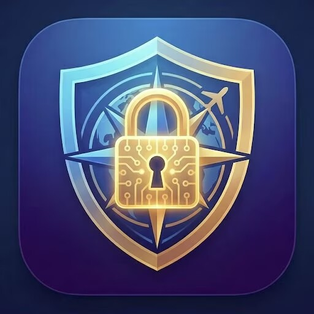

# SceneryShield

---

# 🌍 Overview | 项目简介 | Présentation | 概要

---

## English

**SceneryShield** is a professional-grade DRM and encryption framework designed specifically for Microsoft Flight Simulator (MSFS) scenery developers.

It protects commercial scenery assets through secure file isolation, license validation, and traceable digital fingerprinting — enabling creators to maintain full control over distribution while preserving a seamless end-user experience.

The first production deployment has been successfully implemented for **Ryan Ye – Wenzhou Longwan Airport (ZSWZ)**.

---

## 中文（简体）

**SceneryShield** 是专为 Microsoft Flight Simulator（MSFS）地景开发者打造的专业级 DRM 加密保护框架。

通过文件物理隔离、许可证验证机制以及可追踪数字指纹技术，帮助创作者在不影响用户体验的前提下，全面掌控资产分发与版权安全。

首个正式版本已成功应用于 **Ryan Ye 温州龙湾机场（ZSWZ）** 项目。

---

## Français

**SceneryShield** est un framework professionnel de DRM et de chiffrement conçu spécialement pour les développeurs de scènes Microsoft Flight Simulator (MSFS).

Il protège les actifs commerciaux grâce à l’isolation sécurisée des fichiers, à la validation des licences et à l’empreinte numérique traçable — permettant aux créateurs de garder un contrôle total sur la distribution tout en garantissant une expérience utilisateur fluide.

La première version en production a été déployée avec succès pour **l’aéroport Wenzhou Longwan (ZSWZ) de Ryan Ye**.

---

## 日本語

**SceneryShield** は、Microsoft Flight Simulator（MSFS）向けシーナリー開発者のために設計されたプロフェッショナルな DRM・暗号化フレームワークです。

ファイルの安全な隔離、ライセンス認証、追跡可能なデジタルフィンガープリント技術により、ユーザー体験を損なうことなく配布管理と著作権保護を実現します。

初の本番導入は **Ryan Ye 氏による温州龍湾空港（ZSWZ）プロジェクト** にて実装されています。

---

# 📩 Demo & Developer Support

# 演示与开发者支持 | Démo & Support Développeur | デモ・開発者サポート

---

## English

At this early stage, SceneryShield is offering:

* Private technical demonstrations
* Direct collaboration with scenery developers
* **Free encryption and packaging services for selected commercial projects**

If you are preparing a paid MSFS release and would like professional asset protection, feel free to reach out.

📧 Contact: **[skylarkning@gmail.com](mailto:skylarkning@gmail.com)**
🌐 GitHub: Please open an issue or contact via the email above.

---

## 中文

在当前早期阶段，SceneryShield 提供：

* 私人技术演示
* 与地景开发者的直接合作支持
* **部分商业项目的免费加密与封装服务**

如果您正在准备发布付费 MSFS 项目，并希望获得专业资产保护，欢迎联系。

📧 邮箱：**[skylarkning@gmail.com](mailto:skylarkning@gmail.com)**
🌐 GitHub：可通过 Issue 或上述邮箱联系。

---

## Français

À ce stade précoce, SceneryShield propose :

* Des démonstrations techniques privées
* Une collaboration directe avec les développeurs
* **Des services gratuits de chiffrement et de packaging pour certains projets commerciaux**

Si vous préparez une sortie MSFS payante et souhaitez une protection professionnelle de vos actifs, n'hésitez pas à nous contacter.

📧 Contact : **[skylarkning@gmail.com](mailto:skylarkning@gmail.com)**
🌐 GitHub : Ouvrez une issue ou contactez via l’email ci-dessus.

---

## 日本語

現在の初期段階において、SceneryShield は以下を提供しています：

* 個別対応の技術デモ
* シーナリー開発者との直接協力
* **一部商用プロジェクト向け無料暗号化・パッケージングサービス**

有料 MSFS プロジェクトの公開を予定しており、専門的な保護をご希望の場合はお気軽にご連絡ください。

📧 Email: **[skylarkning@gmail.com](mailto:skylarkning@gmail.com)**
🌐 GitHub：Issue または上記メールよりお問い合わせください。
