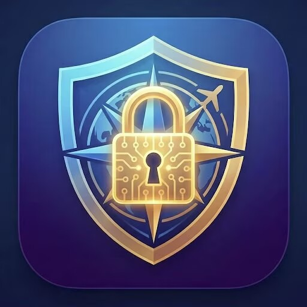

# SceneryShield

> **A professional DRM and offline license management framework for MSFS 2020/2024 scenery developers.**

---

# 🌍 Overview | 项目简介 | Présentation | 概要
Latest Version: SceneryShield 1.1

Last updated on March 5, 2026

---
## English

**SceneryShield** is a professional-grade DRM and encryption framework designed specifically for Microsoft Flight Simulator (MSFS) scenery developers.

It protects commercial scenery assets through secure file isolation, license validation, and traceable digital fingerprinting — enabling creators to maintain full control over distribution while preserving a seamless end-user experience.

The first production deployment has been successfully implemented for **Ryan Ye – Wenzhou Longwan Airport (ZSWZ)**.
🔗 Product Page: [https://secure.simmarket.com/ryanye-wenzhou-longwan-airport-zswz-msfs2024.phtml](https://secure.simmarket.com/ryanye-wenzhou-longwan-airport-zswz-msfs2024.phtml)

---

## 中文（简体）

**SceneryShield** 是专为 Microsoft Flight Simulator（MSFS）地景开发者打造的专业级 DRM 加密保护框架。

通过文件物理隔离、许可证验证机制以及可追踪数字指纹技术，帮助创作者在不影响用户体验的前提下，全面掌控资产分发与版权安全。

首个正式版本已成功应用于 **Ryan Ye 温州龙湾机场（ZSWZ）** 项目。
🔗 产品页面：[https://secure.simmarket.com/ryanye-wenzhou-longwan-airport-zswz-msfs2024.phtml](https://secure.simmarket.com/ryanye-wenzhou-longwan-airport-zswz-msfs2024.phtml)

---

## Français

**SceneryShield** est un framework professionnel de DRM et de chiffrement conçu spécialement pour les développeurs de scènes Microsoft Flight Simulator (MSFS).

Il protège les actifs commerciaux grâce à l’isolation sécurisée des fichiers, à la validation des licences et à l’empreinte numérique traçable — permettant aux créateurs de garder un contrôle total sur la distribution tout en garantissant une expérience utilisateur fluide.

La première version en production a été déployée avec succès pour **l’aéroport Wenzhou Longwan (ZSWZ) de Ryan Ye**.
🔗 Page produit : [https://secure.simmarket.com/ryanye-wenzhou-longwan-airport-zswz-msfs2024.phtml](https://secure.simmarket.com/ryanye-wenzhou-longwan-airport-zswz-msfs2024.phtml)

---

## 日本語

**SceneryShield** は、Microsoft Flight Simulator（MSFS）向けシーナリー開発者のために設計されたプロフェッショナルな DRM・暗号化フレームワークです。

ファイルの安全な隔離、ライセンス認証、追跡可能なデジタルフィンガープリント技術により、ユーザー体験を損なうことなく配布管理と著作権保護を実現します。

初の本番導入は **Ryan Ye 氏による温州龍湾空港（ZSWZ）プロジェクト** にて実装されています。
🔗 製品ページ：[https://secure.simmarket.com/ryanye-wenzhou-longwan-airport-zswz-msfs2024.phtml](https://secure.simmarket.com/ryanye-wenzhou-longwan-airport-zswz-msfs2024.phtml)

---

# 📩 Demo & Developer Support

# 演示与开发者支持 | Démo & Support Développeur | デモ・開発者サポート

---

## English

At this early stage, SceneryShield is offering:

* Private technical demonstrations
* Direct collaboration with scenery developers
* **Free encryption and packaging services for selected commercial projects**

If you are preparing a paid MSFS release and would like professional asset protection, feel free to reach out.

📧 Contact: **[skylarkning@gmail.com](mailto:skylarkning@gmail.com)**
🌐 GitHub: Please open an issue or contact via the email above.

---

## 中文

在当前早期阶段，SceneryShield 提供：

* 私人技术演示
* 与地景开发者的直接合作支持
* **部分商业项目的免费加密与封装服务**

如果您正在准备发布付费 MSFS 项目，并希望获得专业资产保护，欢迎联系。

📧 邮箱：**[skylarkning@gmail.com](mailto:skylarkning@gmail.com)**
🌐 GitHub：可通过 Issue 或上述邮箱联系。

---

## Français

À ce stade précoce, SceneryShield propose :

* Des démonstrations techniques privées
* Une collaboration directe avec les développeurs
* **Des services gratuits de chiffrement et de packaging pour certains projets commerciaux**

Si vous préparez une sortie MSFS payante et souhaitez une protection professionnelle de vos actifs, n'hésitez pas à nous contacter.

📧 Contact : **[skylarkning@gmail.com](mailto:skylarkning@gmail.com)**
🌐 GitHub : Ouvrez une issue ou contactez via l’email ci-dessus.

---

## 日本語

現在の初期段階において、SceneryShield は以下を提供しています：

* 個別対応の技術デモ
* シーナリー開発者との直接協力
* **一部商用プロジェクト向け無料暗号化・パッケージングサービス**

有料 MSFS プロジェクトの公開を予定しており、専門的な保護をご希望の場合はお気軽にご連絡ください。

📧 Email: **[skylarkning@gmail.com](mailto:skylarkning@gmail.com)**
🌐 GitHub：Issue または上記メールよりお問い合わせください。

---

# 🚀 Next Steps | 下一步计划 | Prochaines Étapes | 今後の計画

SceneryShield will continue evolving with a focus on automation, scalability, and advanced license control.

SceneryShield 将持续发展，重点提升自动化能力、可扩展性与授权管理控制。

SceneryShield continuera d’évoluer avec un accent sur l’automatisation, l’évolutivité et le contrôle avancé des licences.

SceneryShield は自動化・拡張性・高度なライセンス管理を中心に、今後も進化を続けます。

---

## 1️⃣ Developer GUI Application | 自助加密应用

**Target Release: May 2026**

### English

Development of a dedicated GUI application that will allow scenery creators to encrypt, package, and publish their projects independently.

The application will streamline the SceneryShield workflow and provide an intuitive interface for license generation and release management.

### 中文

开发专用 GUI 应用程序，使地景开发者能够自主完成项目加密、封装与发布。

该工具将优化 SceneryShield 工作流程，并提供直观的许可证生成与发布管理界面。

### Français

Développement d’une application GUI dédiée permettant aux développeurs de scènes de chiffrer, empaqueter et publier leurs projets de manière indépendante.

L’application simplifiera le flux de travail SceneryShield et offrira une interface intuitive pour la génération et la gestion des licences.

### 日本語

シーナリー開発者が自ら暗号化・パッケージ化・公開を行える専用 GUI アプリケーションを開発予定です。

SceneryShield のワークフローを簡素化し、ライセンス生成およびリリース管理のための直感的なインターフェースを提供します。

---

## 2️⃣ Remote License Management System | 远程许可证管理系统

**Target Release: September 2026**

### English

Implementation of a secure remote license management system providing advanced distribution control for commercial scenery products.

Planned capabilities include:

* Limiting the number of simultaneous installations across different devices
* Real-time license validation
* Immediate revocation of licenses involved in piracy
* Centralized monitoring and control

### 中文

构建安全的远程许可证管理系统，为商业地景产品提供更高级别的分发控制能力。

计划功能包括：

* 限制不同设备上的同时安装数量
* 实时许可证验证
* 对涉及盗版的许可证进行即时吊销
* 集中式监控与管理

### Français

Mise en place d’un système sécurisé de gestion de licences à distance offrant un contrôle avancé de la distribution des produits commerciaux.

Fonctionnalités prévues :

* Limitation du nombre d’installations simultanées sur différents appareils
* Validation des licences en temps réel
* Révocation immédiate des licences impliquées dans le piratage
* Surveillance et contrôle centralisés

### 日本語

商用シーナリー製品向けに高度な配布管理を可能にする、安全なリモートライセンス管理システムを実装予定です。

予定機能：

* 複数デバイス間での同時インストール数の制限
* リアルタイムライセンス検証
* 不正利用が確認されたライセンスの即時無効化
* 集中管理および監視機能
